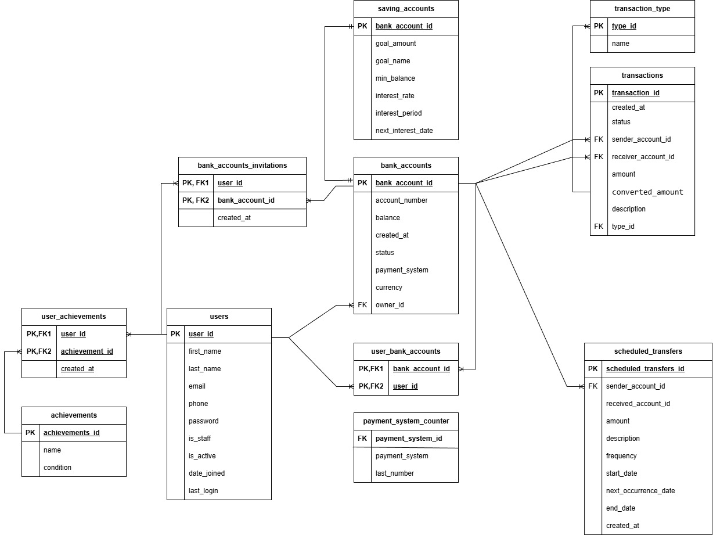
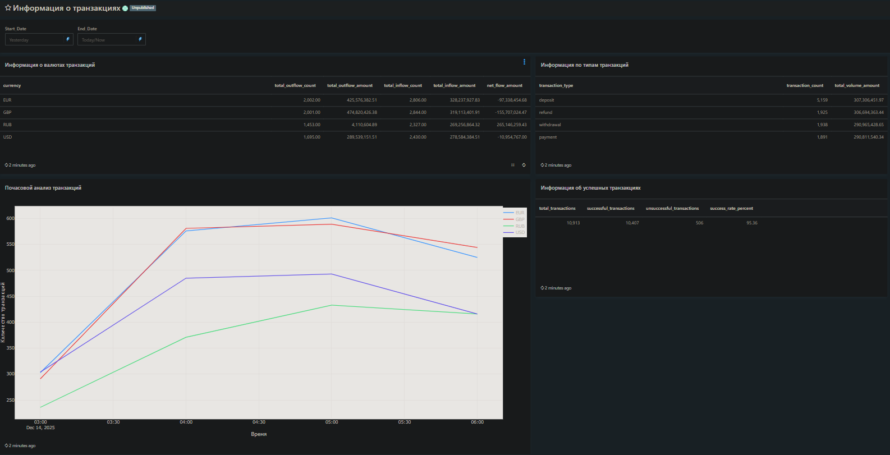
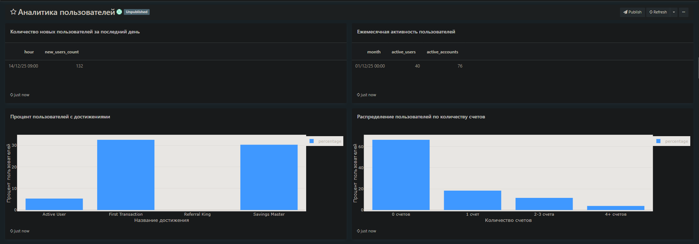

# FEFU_data_analytics

Assignment for the data analytics course

## Project Overview

This project simulates a banking system with:
- User accounts and profiles
- Banking operations
- Scheduled payments
- User achievements system
- Real-time data generation
- Redash dashboard for data visualization

## Quick start

1. Clone the repository to your computer:
```bash
git clone https://github.com/deep-learning-engineer/FEFU_data_analytics.git
```

2. Run containers with the command:
```bash
docker compose up -d
```

## Database architecture


## Dashboard Examples

**Transaction Dashboard:** 


**User Dashboard:**

